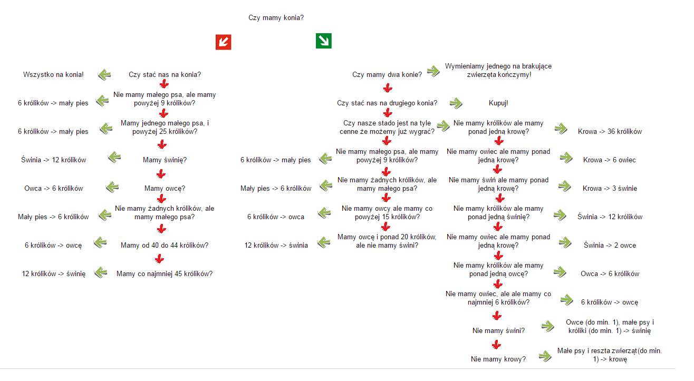

Marianna Dzik & Piotr Radziñski

08.11.2016r.

#Wstêp
Celem naszego projektu jest stworzenie symulatora gry w Superfarmer dla pojedyñczego gracza wraz z autorsk¹ strategi¹. Nastêpnie liczymy szacowany czas gry na zadanej próbce n gier. W poni¿szym raporcie przedstawimy dzia³anie projektu krok po kroku.

#Losowanie kostk¹

##Sposób losowania

###Rzut kostkami

Do losowania wykorzystujemy funkcjê sample. Jest ona bardzo wygodna w przypadku losowania kostk¹ wieloœcienn¹, na której mo¿e byæ kilka tych samych zwierz¹t, gdy¿ pozwala nam wybraæ prawdopodobieñstwo z jakim dostaniemy konkretne zwierze. Aby u³atwiæ dalsze obliczenia zawsze losujemy spoœród wszystkich mo¿liwych zwierz¹t, lecz te, których nie mo¿emy otrzymaæ z danej kostki maj¹ prawdopodobieñstwo 0.
```{r}
rzut_kostkami <- function() {
  #Losowanie kostka.
  kostka_wilk <- sample(1:9, 1, TRUE, prob = c(0, 1 / 12, 1 / 12, 1 / 4, 1 /
                                                2, 0, 0, 0, 1 / 12))
  kostka_lis <- sample(1:9, 1, TRUE, prob = c(1 / 12, 0, 1 / 6, 1 / 6, 1 /
                                               2, 0, 0, 1 / 12, 0))
  
  #Zmienne przechowujace ilosc poszczegolnych zwierzat na kostce.
  kostki <- rep(0, times = 9)
  
  kostki[kostka_wilk] <- kostki[kostka_wilk] + 1
  kostki[kostka_lis] <- kostki[kostka_lis] + 1
  return(kostki)
}
```

### Kontrola wilka i lisa
Funkcja zeruj¹ca odpowiednie zwierzaczki i zwracaj¹ca wartoœæ stada w wypadku, gdy na kostkach otrzymamy wilka i/lub lisa.
```{r}
wilk_i_lis <- function(stado. = stado, kostki = rzut) {
  if (kostki[wilk] == 1) {
    if (stado.[duzy_pies] != 0) {
      stado.[duzy_pies] <- stado.[duzy_pies] - 1
    } else {
      stado.[krolik] <- 0
      stado.[owca] <- 0
      stado.[swinia] <- 0
      stado.[krowa] <- 0
    }
  }
  if (kostki[lis] == 1) {
    if (stado.[maly_pies] > 0) {
      stado.[maly_pies] <- stado.[maly_pies] - 1
    } else {
      stado.[krolik] <- 0
    }
  }
  return(stado.)
}
```

### Zwiekszenie stada

Funkcja rozmna¿aj¹ca stado w zale¿noœci od wyrzuconych na koœciach zwierz¹t, zwraca wektor stada.
```{r}
rozmnazanie <- function(stado. = stado, kostki = rzut, limit. = limit) {
  for (j in 1:5)
  {
    if (kostki[j] > 0)
      stado.[j] <- min(stado.[j] + as.integer((stado.[j] + kostki[j]) / 2), limit.[j])
  }
  return(stado.)
}
```

### Losowanie wraz z przeliczeniem stada
W tej funkcji zbieramy rzut kostkami oraz funkcje przeliczaj¹ce jak stado powinno wygl¹daæ na zakoñcznie tury.
```{r}
po_losowaniu <- function(stado.. = stado){
    rzut <- rzut_kostkami()
    stado.. <- wilk_i_lis(stado. = stado.., kostki = rzut)
    stado.. <- rozmnazanie(stado. = stado.., kostki = rzut)  
    return(stado..)
}
```

#Nasza Strategia  
##Opis  
Ka¿dy farmer wie, ¿e naj³atwiej w ¿yciu jest tym, co posiadaj¹ konia. Jednak, gdy nie staæ nas na konia okazuje siê, ¿e podstaw¹ zró¿nicowanego gospodarstwa s¹ tylko i wy³¹cznie króliki. I psy, ale tych mniej. Niemniej gdy królików jest wiêcej ni¿ klatek, spogl¹daj¹c na przywódców wschodnich krain fajnie jest dosiadaæ konia. 

Nasz¹ strategiê dzielimy na dwie fazy:

Faza I

Gdy nie mamy konia, naszym celem jest oczywiœcie go mieæ! I czynimy tak gdy tylko jest to mo¿liwe. Wczeœniej, chcemy mieæ jak najwiêcej królików. Dbamy oczywiœcie o ich bezpieczeñstwo za pomoc¹ ma³ego psa, b¹dŸ nawet dwóch (gdyby wilk nam zjad³ króliczki to za coœ chcemy je od niego odkupiæ). Dbamy oczywiœcie o dobre warunki do rozmna¿ania siê dla królików, aby nie zabrak³o dla nich miejsca (ot, czasem trochê baraniny).

Faza II

Mamy konia! Czego wtedy chce ka¿dy zach³anny farmer? Oczywiœcie drugiego.
Strategia bardzo siê nie zmienia: zwracamy troszkê wiêcej uwaga na co zamieniamy nadmiary królików i nie chcemy trzymaæ w zagrodzie zbyt du¿o niepotrzebnych pysków do ¿arcia. Staramy siê zatem ju¿ d¹¿yæ do posiadania ka¿dego zwierzaka po jednym. Jeœli brakowa³o by nam i owiec i œwiñ i wielu innych przyjaznych i puszystych zwierzaczków, ale staæ nas by by³o na drugiego konia, to my bardzo chêtnie go zdobywamy! W koñcu ka¿dy superfarmer wie, ¿e konie s¹ nieœmiertelne! Gdy mamy dwa konie, oczywiœcie zamieniamy jednego z nich na ca³e stato zwierzaczków aby cieszyæ siê chwa³¹ s³owiañskiego rolnika. 

##Diagram przedstawiaj¹cy strategiê:


##Funkcje u¿yte do strategii
###Liczenie wartoœci stada
Jest to funkcja pomocnicza, zlicza ile nasze stado jest warte "w królikach". Czyli przelicza ile moglibyœmy otrzymaæ królików z naszego stada nie bior¹c pod uwagê ograniczenia.
Korzysta ona z wektora, który przechowuje wartoœæ poszczególnych zwierz¹t "w królikach" (wartosc_w_krolikach).
```{r}
wartosc_stada <- function(stado1 = stado, wartosc_w_krolikach1=wartosc_w_krolikach){
  wartosc <- 0
  for(j in 1:7){
    wartosc <- wartosc + stado1[j]*wartosc_w_krolikach1[j]
  }
  return(wartosc)
}
```
###Zamiana zwierzêcia jednego rodzaju na zwierze innego rodzaju
Jest to funkcja, która jako argumenty przejmuje rodzaj zwierzêcia, które chcemy oddaæ oraz rodzaj zwierzêcia które chcemy dostaæ. Mamy dwie opcje:   

1) oddawane zwierze jest wiekszej wartoœci, ni¿ zyskiwane -> obliczmy ile otrzymamy za to zwierze mniejszych zwierz¹tek i zmieniamy stado,  

2) oddajemy kilka zwierz¹t mniejszej wartoœci i zyskujemy jedno zwierze wiekszej wartoœci ->
po obliczeniach ile zwierz¹t musimy oddaæ zamieniamy wartoœæ stada.  

W funkcji tej zak³adamy poprawnoœæ danych, nale¿y wiêc je sprawdziæ przed uruchomieniem funkcji!

```{r}

zamien_zwierze_na_zwierze <- function(oddajemy, dostajemy, stado1 = stado, wartosc_w_krolikach1 = wartosc_w_krolikach)
{ 
  ilosc <- 0
  if( wartosc_w_krolikach1[oddajemy] >= wartosc_w_krolikach1[dostajemy] ){
    ilosc <- wartosc_w_krolikach1[oddajemy]/wartosc_w_krolikach1[dostajemy]
    stado1[oddajemy] <- stado1[oddajemy] -  1
    stado1[dostajemy] <- stado1[dostajemy] + ilosc
  }else{
    ilosc <- wartosc_w_krolikach1[dostajemy]/wartosc_w_krolikach1[oddajemy]
    stado1[oddajemy] <- stado1[oddajemy] -  ilosc
    stado1[dostajemy] <- stado1[dostajemy] + 1
  }
  return(stado1)
}
```
###Zamiana mniejszych zwierzat ró¿nych rodzajów na jedno wiêksze
Teraz mamy przypadek taki, w którym oddajemy ró¿ne rodzaje zwierz¹t. Funkcja dzia³a dla 3 rodzajów du¿ych zwierzat: koñ, krowa i œwinia. Dla ka¿dego zwierzêcia sprawdzamy, które zwierzaki maj¹ od niego mniejsz¹ lub równa wartoœæ. Nastêpnie przechodzimy po tych zwierzakach w kolejnoœci od najwiêkszej do najmniejszej "wartoœci w królikach" i wymiwniamy zwierzaczki, a¿ skoñczy nam sie ten rodzaj zwierz¹t lub zwrócimy juz wystarczajaco, aby pokryæ wartoœæ krowy. Wa¿ne jest sprawdzenie przed uzyciem funkcji, czy mamy wystarczaj¹co du¿o zwierz¹t.
```{r}
zamien_na_duze <- function(zwierz, stado1=stado, wartosc_w_krolikach1 = wartosc_w_krolikach){
  
  if(zwierz == kon){
    kolejnosc_zamiany <- c(duzy_pies, krowa, swinia, owca, maly_pies, krolik)
  }
  if(zwierz == swinia){
    kolejnosc_zamiany <- c(owca, maly_pies, krolik)
  }
  if(zwierz == krowa){
      kolejnosc_zamiany <- c(duzy_pies, swinia, owca, maly_pies, krolik)
  }
  do_oddania <- - wartosc_w_krolikach1[zwierz]
   stado1[zwierz] <- stado1[zwierz] + 1
#Kolejnosc zwierzat ma znaczenie! Przechodze od najwiekszych wartosci, tak aby wartosc kolejnych #zwierzat dzielila wartosc poprzednich. W ten sposob nie oddam za duzo zwierzat
  for(j in kolejnosc_zamiany){
    while(do_oddania < 0 && stado1[j] > 0){
      stado1[j] <- stado1[j] - 1
      do_oddania <- do_oddania + wartosc_w_krolikach1[j]
    }
  }
  return(stado1)
}
```
###Strategia przed pierwszym koniem
Funkcja której u¿ywamy, gdy nie mamy jeszcze ¿adnego konia.  
Jako argumenty przyjmuje wektory: stado i wartosc_w_krolikach i zwraca nam wektor dwuargumentowy: ruch_zamiana. Mamy tutaj dwie mo¿liwoœci: 

1) chcemy zaminiæ jeden rodzaj zwierzecia na jeden rodzaj zwierzecia (czyli uzyc funkcji zamin_zwierze_na_zwierze). Wtedy na pierwszym miejscu wektora jest rodzaj zwierzecia, ktory chcemy oddaæ, a na drugim ten, który chcemy dostaæ,  

2) chcemy zamieniæ kilka rodzajów mniejszych zwierz¹tek na jedno wiêksze zwierze (funkcja: zamien_na_duze). Na pierwszym miejscu jest zwierze, które chcemy otrzymaæ, a na drugim wartoœæ kontrolna 50.

```{r}
brak_konia <-function(stad = stado, wartosc_w_k = wartosc_w_krolikach ){
    ruch_zamiana <- c(0,0)
  
      if (wartosc_stada(stad, wartosc_w_k) >= 72) {
          ruch_zamiana <- c(kon, 50)
      } else if ((stad[maly_pies] == 0 && stad[krolik] > 9) || (stad[maly_pies] == 1 && stad[krolik] > 25) ) {
          ruch_zamiana<-c(krolik, maly_pies)
      } else if (stad[krolik]  < 27 && stad[swinia] > 0) {
          ruch_zamiana <- c(swinia, krolik)
      } else if (stad[krolik]  < 33 && stad[owca] > 0 ) {
          ruch_zamiana <-c (owca, krolik)
      } else if (stad[krolik] == 0  && stad[maly_pies] > 0 ) {
       ruch_zamiana <- c(maly_pies, krolik)
      } else if (45 > stad[krolik] && stad[krolik] > 39  && stad[owca] < 23) {
       ruch_zamiana <- c(krolik, owca)
      } else if (46 < stad[krolik] && stad[swinia] < 20) {
        ruch_zamiana <- c(krolik, swinia)          
      }
    return(ruch_zamiana)
} 
```
###Strategia, gdy mamy pierwszego konia
Najpierw zdefiniujê funkcje pomocnicze. Wszystkie dzia³aj¹ podobnie do poprzedniej.  

1) Funkcja rozpatruj¹ca przypadek, gdy mamy jednego konia oraz wartoœæ stada jest w przedziale [127, 144).
```{r}
jeden_kon_wiecej_niz_127 <- function( stado. = stado ){
      ruch_zamiana <- c(0,0)
      if (stado.[krolik] == 0 && stado.[krowa] > 1 ) {
          ruch_zamiana <- c(krowa, krolik)
      } else if (stado.[owca] == 0 && stado.[krowa] > 1 ) {
          ruch_zamiana <- c(krowa, owca)
      } else if (stado.[swinia] == 0 && stado.[krowa] > 1 ) {
          ruch_zamiana <- c(krowa, swinia)
      } else if (stado.[krolik] == 0 && stado.[swinia] > 1 ) {
          ruch_zamiana <- c(swinia, krolik)
      } else if (stado.[owca] == 0 && stado.[swinia] > 1 ) {
          ruch_zamiana <- c(swinia, owca)
      } else if (stado.[krolik] == 0 && stado.[owca] > 1 ) {
          ruch_zamiana <- c(owca, krolik)
      } else if (stado.[owca] == 0 && stado.[krolik] > 6 ) {
         ruch_zamiana <- c(krolik, owca)
      } else if (stado.[swinia] == 0 ) {
        ruch_zamiana <- c(swinia, 50)
      } else if (stado.[krowa] == 0 ) {
        ruch_zamiana <- c(krowa, 50)   
      } 
      return (ruch_zamiana)
}
```
2) Funkcja rozpatruj¹ca przypadek, gdy mamy jednego konia oraz wartoœæ stada mniejsz¹ ni¿ 127.
```{r}
jeden_kon_mniej_niz_127 <- function( stado. = stado ){
        ruch_zamiana <- c(0,0)
       if (stado.[maly_pies] == 0 && stado.[krolik] > 9 ) {
         ruch_zamiana <- c(krolik, maly_pies)
       }else if (stado.[krolik] == 0 && stado.[maly_pies] > 0 ) {
         ruch_zamiana <- c(maly_pies, krolik)
       } else if (stado.[owca] == 0 && stado.[krolik] > 15 ) {
         ruch_zamiana <- c(krolik, owca)
       } else if (stado.[owca] > 0 && stado.[krolik] > 20 && stado.[swinia] == 0 ) {
         ruch_zamiana <- c(krolik, swinia)
       }  
      return (ruch_zamiana)
}
```
Funkcja w³aœciwa. Rozpatruje ca³¹ nasz¹ strategiê w przypadku jednego konia, dziel¹c ca³oœæ w zale¿noœci od wartoœci stada na 3 przypadki: wartoœæ wiêksza ni¿ 144, w przedziale [127, 144) oraz mniejsza ni¿ 127.
```{r}
jeden_kon <- function( stad = stado, wartosc_w_k = wartosc_w_krolikach ){
      ruch_zamiana <- c(0,0)
  if ( wartosc_stada(stad, wartosc_w_k) >= 144 ) {
       ruch_zamiana <- c(kon, 50)
  } else if (wartosc_stada(stad, wartosc_w_k) >= 127 ) {
      ruch_zamiana <- jeden_kon_wiecej_niz_127(stad)
  } else if (wartosc_stada(stad, wartosc_w_k) < 127) {
      ruch_zamiana <- jeden_kon_mniej_niz_127(stad)
  }
  return (ruch_zamiana)
}
```
###Stado przy 0 lub 1 koniu
Funkcja, która korzystaj¹c z powy¿szych funkcji zwraca wartoœæ stada po zastosowaniu strategi w przypadku 0 lub 1 konia.  
Sprawdza ona, który rodzaj zamiany wystapi³:

1) wiele mniejszych rodzajów na jeden rodzaj (zamien_na_duze)

2) jeden rodzaj na jeden rodzaj (zamien_zwierze_na_zwierze)
```{r}
brak_lub_1_kon <- function( stad. = stado, wartosc_w_k. = wartosc_w_krolikach ){
        if(stad.[kon] == 0){
        ruch_zmiana <- brak_konia( stad., wartosc_w_k. )
      } else{
              ruch_zmiana <- jeden_kon( stad., wartosc_w_k. )
      }
#Jeœli ruch_zmiana[1] > 0 to wiemy, ¿e jakiœ ruch siê odby³ (jak 0, to nie by³o ¿adnego ruchu).
      if(ruch_zmiana[1] > 0){
        if(ruch_zmiana[2] == 50){
          stad. <- zamien_na_duze(ruch_zmiana[1])
        } else {
          stad. <- zamien_zwierze_na_zwierze(ruch_zmiana[1], ruch_zmiana[2])
        }
      } 
  return (stad.)
  }
```
###Wiecej ni¿ jeden koñ
Gdy mamy wiêcej ni¿ jednego konia, to mo¿emy zakoñczyæ grê. Wymieniamy wtedy jednego konia na pozosta³e zwierzaki. Idziemy od najwiekszych zwierz¹t i zwiêkszamy ich iloœæ. Ze specyfiki naszej strategii rozpatrujemy tylko przypadek, ¿e mamy za du¿o królików. Wtedy zamiast zwiêkszaæ jeszcze króliki, zwiêkszamy owce. Niemniej jednak nie mia³oby to wiêkszego znaczenia nawet jeœli zwiêkszylibyœmy na si³ê króliki ponad ograniczenie, gdy¿ za chwilê i tak gra siê zakoñczy (mamy wszystkie zwierzêta!).
```{r}
wiecej_niz_1_kon <- function( stad = stado ){
      stad[kon] <- stad[kon] - 1
      stad[krowa] <- stad[krowa] + 1
      stad[swinia] <- stad[swinia] + 2
      stad[owca] <- stad[owca] + 1
      if (stad[krolik] < 54){
        stad[krolik] <- stad[krolik] + 6
      } else { 
      stad[owca] <- stad[owca] + 1
      }
  
    return (stad)
  }
```
###Ca³a strategia
Zbieramy teraz wszystkie przypadki w jedno: 0 lub 1 koñ i wiêcej ni¿ jeden koñ.
Funkcja przyjmuje za argumenty wektory: stado i wartoœæ_w_królikach, wywo³uje odpowiedni¹ funkcjê starategii w zale¿noœci od iloœci koni i zwraca now¹ wartoœæ stada.
```{r}
wymiana_stada <- function( stad.. = stado, wartosc_w_k.. = wartosc_w_krolikach ){
  if (stad..[kon] == 0 || stad..[kon] == 1 )
  {
    stad.. <- brak_lub_1_kon( stad.., wartosc_w_k.. )
  }else if (stad..[kon] > 1 ){
    stad.. <- wiecej_niz_1_kon( stad.. )
  }
  return(stad..)
  
}
```

#Sta³e/warunki pocz¹tkowe
Przyjmujemy:

n - iloϾ gier,

dlugosc_gry - przechowuje iloϾ tur w kolejnych grach,

limit - ograniczenia na iloœæ zwierz¹t,

wartosc_w_krolikach - ile za poszczególne zwierzê moglibyœmy mieæ królików  bez ograniczenia na kroliki.

Ustalamy te¿ sta³e o nazwie zwierz¹t, aby korzystaj¹c z wektorów podawaæ nazwê zwierzêcia, a nie liczbê.
```{r}
#Ustalamy potrzebne nam sta³e:
n=10000
dlugosc_gry <- 1:n

kon <- 1
krowa <- 2
swinia <- 3
owca <- 4
krolik <- 5
duzy_pies <- 6
maly_pies <- 7
lis <- 8
wilk <- 9

lockBinding("kon", globalenv())
lockBinding("krowa", globalenv())
lockBinding("swinia", globalenv())
lockBinding("owca", globalenv())
lockBinding("krolik", globalenv())
lockBinding("maly_pies", globalenv())
lockBinding("duzy_pies", globalenv())
lockBinding("lis", globalenv())
lockBinding("wilk", globalenv())

limit <- c(6, 12, 20, 24, 60, 2, 4)
lockBinding("limit", globalenv())
wartosc_w_krolikach <- c(72, 36, 12, 6, 1, 36, 6)
```
#Kod
G³ówny kod odpalaj¹cy nasz¹ symulacjê superfarmera n razy korzystaj¹cy z ca³ego naszego funkcyjnego dorobku. Wektor dlugosc_gry zapamiêtuje ile trwa³a ka¿da z poszczególnych gier dla póŸniejszych wyliczeñ. 
```{r}

for (i in 1:n){
  
  stado <- rep(0, times=7)
  licznik <- 0
  
  repeat{
    stado <- wymiana_stada()
    if (stado[kon] * stado[krowa] * stado[swinia] * stado[owca] * stado[krolik] != 0) break      
    stado <- po_losowaniu() 
    licznik <- licznik + 1
  }
  dlugosc_gry[i] <- licznik
}
```


#Œrednia d³ugoœæ gry:
```{r}
summary(dlugosc_gry)
```

#Wizualizacja wyników:
```{r, echo=FALSE}
hist(dlugosc_gry, breaks=65, col="lightgreen", main=paste("Histogram d³ugoœci gry"), xlab = " d³ugoœæ gry ", ylab = " iloœæ gier o danej d³ugoœci ")

boxplot(dlugosc_gry, col="lightgreen",main=paste("D³ugoœæ gry"), xlab = " ", ylab = " ")

plot(dlugosc_gry, main=paste("D³ugoœæ kolejnych gier"), xlab = " numer gry ", ylab = " d³ugoœæ gry ")
```

#Podsumowanie
##Co osi¹gneliœmy?
Stworzyliœmy symulacjê rzutów kostk¹ oraz wymyœliliœmy strategiê w grze Superfarmer. Za cel postawiliœmy sobiê osi¹gniêcie niskiej wartoœci oczekiwanej gry. W tym celu zmienialiœmy niektóre parametry gry, licz¹c jaka wychodzi wartoœæ oczekiwana dla nich i wybieraliœmy najlepszy wynik.   
Od ostatniej fazy poœwiêciliœmy czas na zamianê d³ugiego kodu na pomniejsze funkcjê, tak, aby kod w³aœciwy by³ jak najkrótszy.

##Co dalej?
W przysz³oœci mo¿na sprawdziæ, czy nie da siê osi¹gn¹c ni¿szej wartoœci oczekiwanej. Mo¿na równie¿ porównaæ wyniki naszej strategii z prostszymi.

